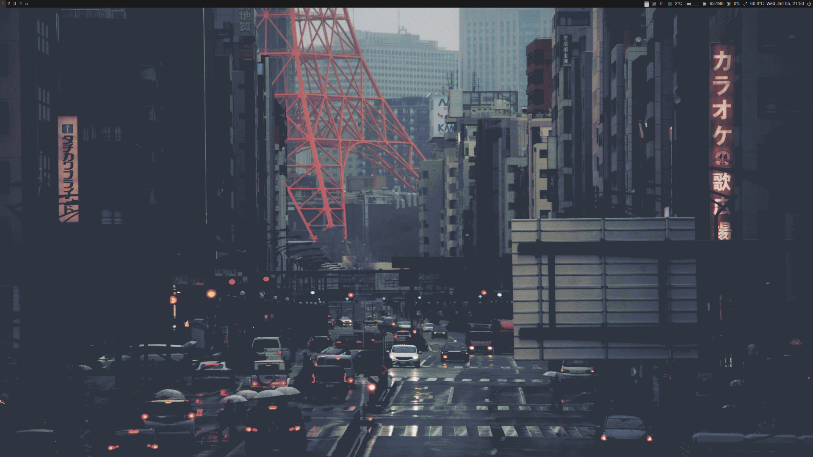

## Description

This is an updated version of my previous only floating WM setup you can find here - https://github.com/dante-robinson/AwesomeWM-dotfiles. This setup is 100% Tiling based and is running on Wayland instead of X11. I am still using a very limited amount of keybinds and you won't find a lot of extra keybinds like others dotfiles. If you are planning to use this setup for personal use just add your own keybinds in the sway config. I tried getting cryptocurrency prices setup in AwesomeWM but couldn't get it working perfectly in this version using SwayWM I have got it setup in waybar.

## Features

- Fast volume shortcuts
- Calendar under clock widget
- Coinmarketcap integration

## Screenshots



## Installation

```
git clone https://github.com/dante-robinson/SwayWM-dotfiles.git && cd dotfiles && mv -f .*  -t ~
```

## Usage

If you would like to change any keybinds inside the config run

`sudo nano ~/.config/sway/config`

If your looking to remove a widget

`sudo nano ~/.config/waybar/config`

or edit the look you can run

`sudo nano ~/.config/waybar/style.css`

After saving any of the files remember to reload sway to see the changes by running Control + Super + R.

## Setup

You will need to go to <a href=https://coinmarketcap.com/api/>Coinmarketcap</a> and sign up and make an API Key. After you have your API Key would will need to run

`sudo nano ~/.config/waybar/modules/crypto/config.ini`

Find the line that says "api_key = " and then add your api key there it doesnt need to be in "".

The wallpaper can be changed by replacing

`~/.config/sway/wall.png`

and then refreshing sway by running Control + Super + R.

You will need the following packages to use the WM Config out of the box without changing much

`sway foot mako wofi slurp grim feh`

## Commands/Shortcuts

Note the Super key I am referring to is the Windows Key

<b>Super + Mouse Button 3 (Right Click) -</b> Resize floating only windows<br>
<b>Control + Super + R -</b> Restart SwayWM<br>
<b>Super + F -</b> Put app in Fullscreen and undo Fullscreen<br>
<b>Super + Q -</b> Kill app<br>
<b>Alt + Control + L -</b> Lock screen<br>
<b>Alt + M -</b> Toggle Mute<br>
<b>Alt + Up Arrow -</b> Increase volume by 5% (Can be changed in config.ini)<br>
<b>Alt + Down Arrow -</b> Decrease volume by 5% (Can be changed in config.ini)<br>
<b>Super + W -</b> Launch wofi<br>
<b>Super + Enter -</b> Launch a foot terminal<br>
<b>Super + Number -</b> Change to that Workspace Number so 5 would bring to Workspace 5<br>
<b>Super + Shift + Number -</b> Move current window to that workspace<br>
<b>PrtScn -</b> Take a screenshot of the entire screen using slurp<br>
<b>Super + PrtScn  -</b> Take a screenshot of a selected area using grim<br>

## Extra dotfiles (Firefox Atom and zsh)

The neovim config is based on ecovim and contains my personal tweaks to it nothing crazy. As for the Firefox config this is a pretty extreme user.js config with a bunch of extensions for added security as well as to use my crypto hardware wallets. If you do use the .mozilla folder you will visit many sites that will not work without having javascript enabled and you will need to enable those sites to be allowed to run javascript through the noScript extension. For most websites they will have alot of javascript from many providers you don't need to enable them all usually for basic functionality. You can make sure the browser config is working correctly by visiting http://browserleaks.com and checking to make sure WebRTC, WebGL and stuff like that is all disabled javascript is enabled through noScript if you want to test those leaks. Location data will depend on your own DNS setup and both the Font and Canvas fingerprinting should be randomized on each refresh. To change your shell to zsh you can run this command

`chsh -s /bin/zsh`

## Additional stuff

#### foot: https://github.com/DanteAlighierin/foot

#### wofi: https://hg.sr.ht/~scoopta/wofi

#### mako: https://github.com/emersion/mako

#### grim: https://github.com/emersion/grim

#### slurp: https://github.com/emersion/slurp

#### ly (optional display manager): https://github.com/fairyglade/ly

#### greetd (another display manager): https://github.com/kennylevinsen/greetd

#### Color Scheme from: https://github.com/roidm/sway-borders

#### pyllyukko user.js template used: https://github.com/pyllyukko/user.js/
