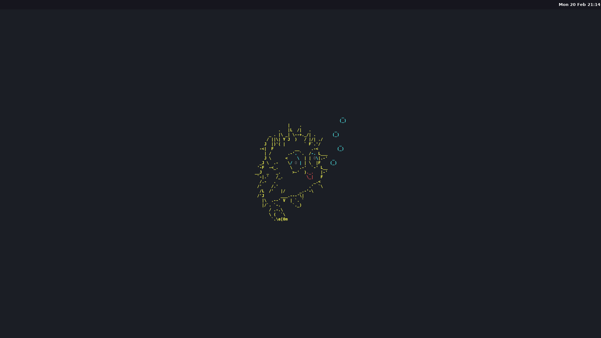

## Description

This is an updated version of my previous only WM setups which you can find by viewing the branches of this repo. This setup is based around OpenBSD and requires sndio for the volume to work other than that it should work with minor tweaking on other distros. I am still using a very limited amount of keybinds and you won't find a lot of extra keybinds like others dotfiles. If you are planning to use this setup for personal use just add your own keybinds in the config.

## Screenshots



## Installation

```
git clone https://github.com/dante-robinson/dotfiles.git && cd dotfiles && mv -f .*  -t ~
```

## Usage

If you would like to change any keybinds or the border colors inside the config run

`doas vim ~/.cwmrc`

After saving any of the file remember to reload cwm to see the changes by running Control + Super + R.

## Setup

The wallpaper can be changed by replacing

`~/OpenBSD.png`

or by changing the location in .xsession

and then refreshing sway by running Control + Super + R.

You will need the following packages to use the WM Config out of the box without changing much

`cwm alacritty dunst rofi scrot feh`

## Commands/Shortcuts

Note the Super key I am referring to is the Windows Key

<b>Super + Mouse Button 1 (Left Click) -</b> Move/Drag Window (also brings window to front)
<b>Super + Mouse Button 3 (Right Click) -</b> Resize floating only windows<br>
<b>Control + Super + R -</b> Restart CWM<br>
<b>Control + Super + Q -</b> Quit CWM<br>
<b>Super + F -</b> Put app in Fullscreen and undo Fullscreen<br>
<b>Super + Q -</b> Kill app<br>
<b>Alt + Control + L -</b> Lock screen<br>
<b>Super + M -</b> Toggle Mute<br>
<b>Super + Up Arrow -</b> Increase volume by 5%<br>
<b>Super + Down Arrow -</b> Decrease volume by 5%<br>
<b>Super + W -</b> Launch rofi<br>
<b>Super + Enter -</b> Launch an alacritty terminal<br>
<b>Super + Number -</b> Change to that Workspace Number so 5 would bring to Workspace 5<br>
<b>Super + Shift + Number -</b> Move current window to that workspace<br>
<b>Super + P -</b> Take a screenshot of the entire screen using slurp<br>
<b>Super + Shift + P  -</b> Take a screenshot of a selected area using grim<br>

## Extra dotfiles (Firefox Neovim and zsh)

The neovim config is my own personal config which can be found here - https://github.com/dante-robinson/Neovim-config As for the Firefox config this is a pretty extreme user.js config with a bunch of extensions for added security as well as to use my crypto hardware wallets. If you do use the .mozilla folder you will visit many sites that will not work without having javascript enabled and you will need to enable those sites to be allowed to run javascript through the noScript extension. For most websites they will have alot of javascript from many providers you don't need to enable them all usually for basic functionality. You can make sure the browser config is working correctly by visiting http://browserleaks.com and checking to make sure WebRTC, WebGL and stuff like that is all disabled javascript is enabled through noScript if you want to test those leaks. Location data will depend on your own DNS setup and both the Font and Canvas fingerprinting should be randomized on each refresh. To change your shell to zsh you can run this command

`chsh -s /bin/zsh`

## Additional stuff

#### Alacritty: https://github.com/alacritty/alacritty

#### rofi: https://github.com/davatorium/rofi

#### dunst: https://github.com/dunst-project/dunst

#### scrot: https://github.com/dreamer/scrot

#### pyllyukko user.js template used: https://github.com/pyllyukko/user.js/
